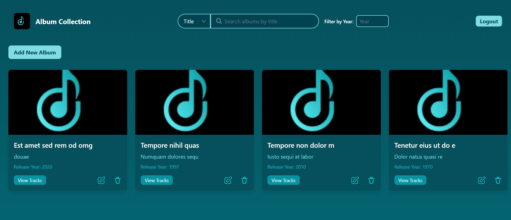
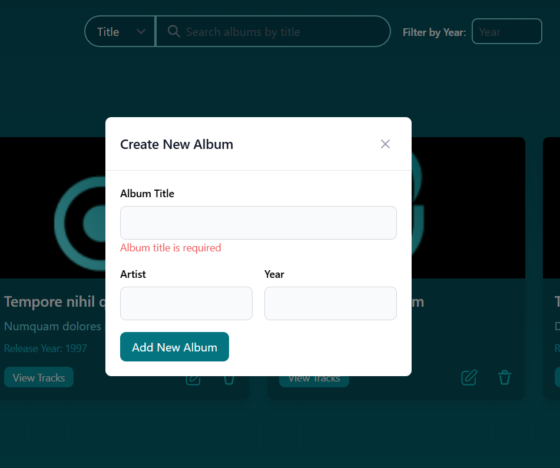
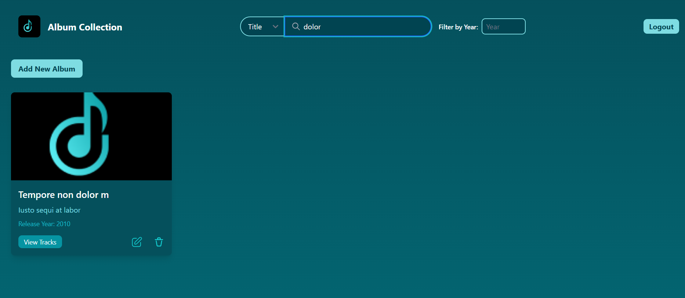
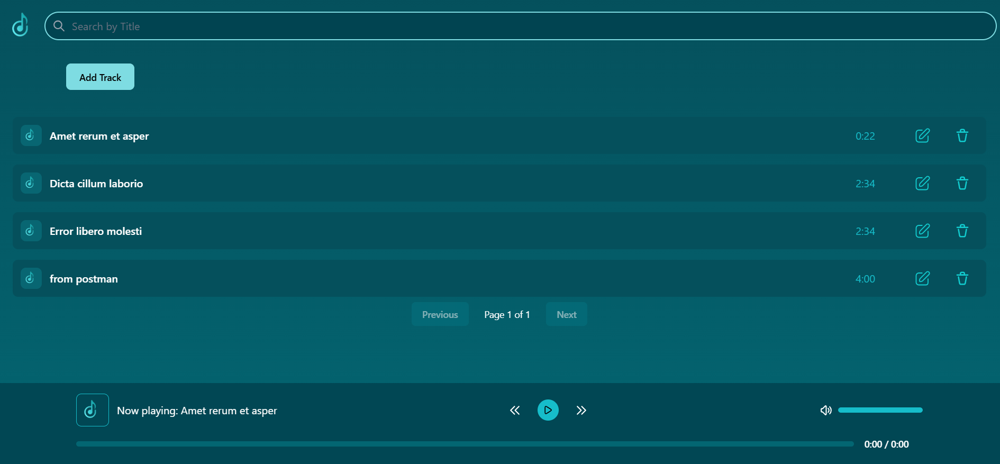
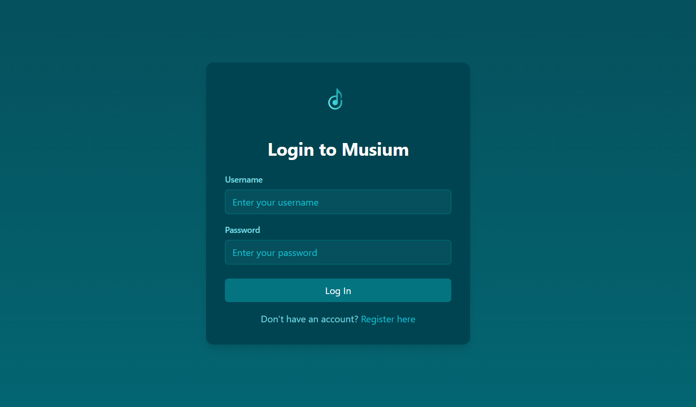

# 🎵 **MusicStream** - Local Music Made Easy 🎵

## 📚 **Project Overview**

"MusicStream" is a lightweight, Angular-based music application designed to simplify listening to and organizing local music files. Built with a focus on modularity and maintainability, the app leverages **NgRx** for efficient state management and a seamless user experience.

The primary goal is to provide an intuitive and responsive platform for users to manage their music library and enjoy tracks with essential playback controls, all while maintaining a robust and scalable architecture.

---

## 💻 **Features**

### 🔹 **Track Management**
- Full **CRUD functionality** for music tracks, including:
    - **Song title** (max 50 characters)
    - **track image**
    - **Artist name**
    - **Optional description** (max 200 characters)
    - **Date added** (automatically recorded)
    - **Track duration** (calculated automatically)
    - **Music category**: Pop, Rock, Rap, Cha3bi, etc.

### 🔹 **Audio Player**
- Core controls:
    - **Play**, **Pause**, **Next**, and **Previous**.
- Volume and progress bar controls.
- Built with **Web Audio API** or equivalent tools.

### 🔹 **File Management**
- Local audio file storage using **IndexedDB**:
    - Files are stored in two tables:
        - **Audio files** (as blobs).
        - **Image files** (as blobs).
        - **Track metadata** (track details).
    - Supported formats: **MP3**, **WAV**, **OGG**.
    - File size limit: **15MB**.

### 🔹 **Cover Art**
- Optional album cover image for each track.
- Supported formats: **PNG**, **JPEG**.

### 🔹 **Validation**
- Character limits:
    - Title: **50 characters**.
    - Description: **200 characters**.
- File validation for audio and images.
- Error handling for uploads and storage.

---

## 🛠 **Technical Features & Architecture**

### **Angular 17**
- **Component-based architecture**: Modular and maintainable.
- **Reactive programming**: Using **RxJS Observables**.
- **Lazy-loaded routing**: Efficient page navigation.
- **Form handling**: Reactive forms for CRUD operations.
- **Pipes**: Formatting durations and other display values.

### **NgRx**
- Comprehensive state management with:
    - **Actions** for event-driven architecture.
    - **Reducers** to handle state changes.
    - **Effects** for managing side effects.
    - **Selectors** to query state efficiently.

### **UI Design**
- Designed with **Figma** or **Adobe XD** for simplicity and clarity.
- Responsive layout using **Bootstrap** or **Tailwind CSS**.

### **Docker Integration**
- Preconfigured Docker setup for easy deployment.

---

## 📊 **Core Pages**

### **Library**
- A searchable list of all tracks in the library.

### **Track View**
- Detailed view of a selected track with playback controls.

### **Optional Pages**
- Additional pages based on future project requirements.

---

## 📦 **Technologies Used**

- **Frontend**: Angular 17, TypeScript, SCSS, Bootstrap/Tailwind CSS.
- **State Management**: NgRx.
- **Storage**: IndexedDB.
- **Unit Testing**: Jasmine.
- **Design**: Figma or Adobe XD.

---

## 🚀 **Getting Started**

### 1. **Clone the repository**

```bash
git clone https://github.com/Douaesb/musicstream.git
cd musicstream
```

### 2. **Install dependencies**

```bash
npm install
```

### 3. **Start the development server**

```bash
ng serve
```

Navigate to `http://localhost:4200` to access the app.

### 4. **Docker Setup**
- Build the Docker image:
  ```bash
  docker build -t musicstream .
  ```
- Run the container:
  ```bash
  docker run -p 4200:4200 musicstream
  ```

---

## 💡 **Future Enhancements**
- **User authentication** for personalized libraries.
- **Cloud synchronization** for music across devices.
- **Integration** with online music platforms or APIs.
- **Advanced equalizer** and audio effects.

---

## 📝 **Contributing**

We welcome contributions! To contribute:
1. Fork the repository.
2. Create a new branch (`git checkout -b feature-name`).
3. Commit your changes (`git commit -am 'Add feature'`).
4. Push to the branch (`git push origin feature-name`).
5. Open a pull request.

---

## 📱 **Screenshots**

**Library Page**:







**Track View**:




---

## 💬 **License**

This project is licensed under the MIT License. See the [LICENSE](LICENSE) file for details.

---

### 🎧 **Start Streaming Your Local Music Today!**

Enjoy a streamlined and customizable music experience with **MusicStream**. 🎶

# Music Catalog API

## Project Description
This project is a secure REST API for managing a music catalog, allowing for album and song management with different access levels (USER/ADMIN) via stateless authentication. The technical architecture is based on Spring Boot and incorporates modern DevOps practices.

## General Objective
The main objective of this application is to provide a robust REST API for:
- Managing albums and songs
- Managing users and their roles
- Offering enhanced security through authentication and access control
- Integrating tools for continuous deployment

## Project Structure
- **Controllers:** Handle HTTP REST requests
- **Services:** Contain business logic
- **Repositories:** Interact with the database
- **DTOs and Mappers:** Transform entities for API responses
- **Exceptions:** Handle API-specific errors

## Main Entities
### Album
- `title` (String)
- `artist` (String)
- `year` (Integer)

### Song
- `title` (String)
- `duration` (Integer)
- `trackNumber` (Integer)

### User
- `login` (String)
- `password` (String)
- `active` (Boolean)
- `roles` (Collection)

### Relationships
- An album can have multiple songs
- A song belongs to a single album

## Project Features
### Album Management
1. List albums with pagination (USER or ADMIN)
2. Search albums by title with pagination and sorting (USER or ADMIN)
3. Search albums by artist (USER or ADMIN)
4. Filter albums by year with pagination and sorting (USER or ADMIN)
5. Add a new album (ADMIN only)
6. Modify an existing album (ADMIN only)
7. Delete an album (ADMIN only)

**Endpoints:**
- `/api/user/albums/**`
- `/api/admin/albums/**`

### Song Management
1. List songs with pagination (USER or ADMIN)
2. Search songs by title with pagination and sorting (USER or ADMIN)
3. List songs of an album with pagination and sorting (USER or ADMIN)
4. Add a new song (ADMIN only)
5. Modify an existing song (ADMIN only)
6. Delete a song (ADMIN only)

**Endpoints:**
- `/api/user/songs/**`
- `/api/admin/songs/**`

### User Management
1. Authentication: `/api/auth/login`
2. Account creation: `POST /api/auth/register`
3. List users: `GET /api/admin/users` (ADMIN only)
4. Role management: `PUT /api/admin/users/{id}/roles` (ADMIN only)

## Security
- **Stateless Authentication:** JWT-based
- **Password Encryption:** BCryptPasswordEncoder
- **Access Restrictions:**
    - `/api/admin/*` requires ADMIN role
    - `/api/user/*` requires USER role
- **Profiles:**
    - **Dev:** For development and testing
    - **Prod:** For production deployment

## Technologies Used
- **Framework:** Spring Boot
- **API:** REST
- **Database:** MongoDB with Spring Data
- **Security:** Spring Security with JWT
- **Build Tool:** Maven
- **CI/CD:** Jenkins
- **Containerization:** Docker
- **Image Repository:** DockerHub
- **Testing:** JUnit, Mockito
- **API Documentation:** Swagger
- **Development Tools:** Git, JIRA (Scrum), Lombok, Spring Boot DevTools, SonarLint

## Installation and Execution Guide

### Prerequisites
- Java 8 or higher
- Maven
- Docker and Docker Compose
- MongoDB

### Steps to Follow
1. Clone the repository:
   ```bash
   git clone https://github.com/Douaesb/musica.git
   cd musica

2. Build the project:

```shellscript
mvn clean install
```


3. Run the Docker containers:

```shellscript
docker-compose up -d
```


4. Access the application:

1. The API will be available at `http://localhost:8080`
2. Test the endpoints using Postman or other API testing tools


## Testing

- Run unit tests: `mvn test`

- Postman collection for API testing is available in the `postman` directory


## Contact

For any questions or suggestions, please contact:

- **Name:** Douae Sebti
- **Email:** [douae.sb411@gmail.com](mailto:douae.sb411@gmail.com)
- **GitHub:** [Douaesb](https://github.com/Douaesb)

## PLanification JIRA
https://douaesb411.atlassian.net/jira/software/projects/MUS/boards/14/backlog?epics=visible&atlOrigin=eyJpIjoiNWMzMzU2YzFjYjY5NDUwNGJjOTBhNWVlNDI1ZmVlZjMiLCJwIjoiaiJ9