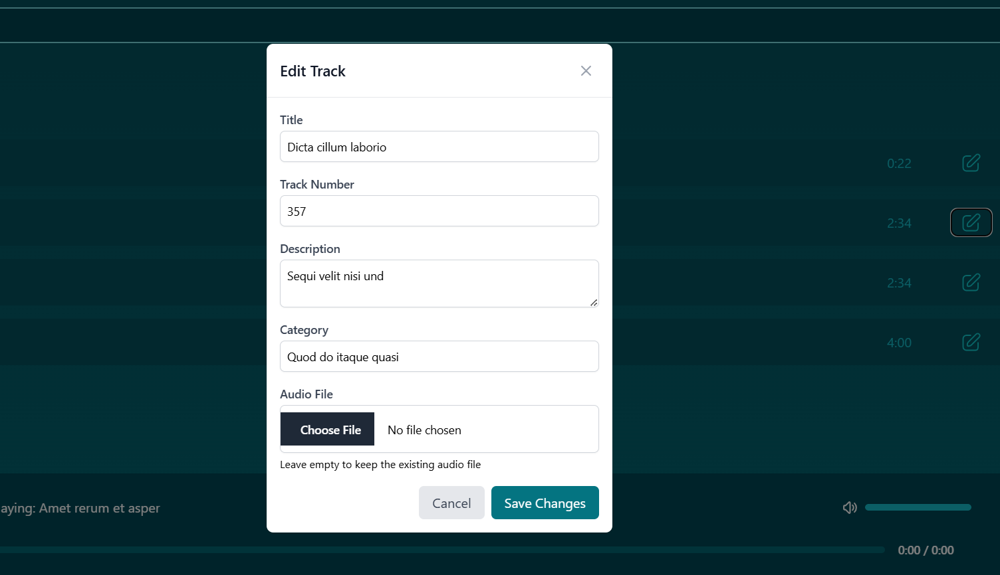

# 🎵 **MusicStream** - Full-Stack Music Streaming Application 🎵

## 📚 **Project Overview**

**MusicStream** is a full-stack music streaming application designed to provide a seamless experience for managing and listening to music. The project combines a **Spring Boot backend** for secure music catalog management and file storage with a modern **Angular frontend** for an intuitive user interface. The application leverages **NgRx** for state management on the frontend and **Spring Security** with **JWT** for secure authentication on the backend.

The goal is to create a robust, scalable, and user-friendly platform for managing albums, songs, and user roles, while offering essential playback controls and a responsive design.

---

## 💻 **Features**

### **Backend (Spring Boot)**
#### 🔹 **Album Management**
- **List albums** with pagination (USER or ADMIN).
- **Search albums** by title, artist, or year with pagination and sorting (USER or ADMIN).
- **Add**, **modify**, or **delete** albums (ADMIN only).

#### 🔹 **Song Management**
- **List songs** with pagination (USER or ADMIN).
- **Search songs** by title or album with pagination and sorting (USER or ADMIN).
- **Add**, **modify**, or **delete** songs (ADMIN only).
- **Upload audio files** (MP3, WAV, OGG) with a size limit of **15MB**.

#### 🔹 **User Management**
- **Authentication** via JWT.
- **Account creation** and role management (ADMIN only).
- **Role-based access control**:
  - `/api/user/**` for USER role.
  - `/api/admin/**` for ADMIN role.

#### 🔹 **File Management**
- **GridFS** for secure storage and streaming of audio files.
- Supported formats: **MP3**, **WAV**, **OGG**.

---

### **Frontend (Angular)**
#### 🔹 **Track Management**
- **CRUD operations** for songs with metadata:
  - Title, artist, description, duration, category, and date added.
- **File upload** for audio tracks.
- **Search and filtering** functionality.

#### 🔹 **Audio Player**
- Core controls: **Play**, **Pause**, **Next**, **Previous**.
- Volume and progress bar controls.
- State management via **NgRx**.

#### 🔹 **User Interface**
- **Authentication** and **registration** pages.
- **Library page** with a list of albums.
- **Album detail page** showing all tracks in the selected album.
- Integrated **audio player** with playback controls.

---

## 🛠 **Technical Features & Architecture**

### **Backend (Spring Boot)**
- **Spring Security**: JWT-based authentication and role-based access control.
- **Spring Data MongoDB**: For database interactions.
- **GridFS**: For storing and streaming audio files.
- **REST API**: Stateless and scalable.
- **Bean Validation**: For input validation.
- **Docker**: Containerization for easy deployment.
- **Jenkins**: Continuous integration and deployment.
- **Unit Testing**: JUnit and Mockito.

### **Frontend (Angular)**
- **Angular 17**: Component-based architecture.
- **NgRx**: State management with actions, reducers, effects, and selectors.
- **RxJS**: Reactive programming for asynchronous operations.
- **Reactive Forms**: For CRUD operations.
- **Bootstrap/Tailwind CSS**: Responsive and modern UI design.
- **Lazy Loading**: Efficient page navigation.
- **HTTP Interceptors**: For authentication and error handling.
- **Guards**: For route protection.
- **Resolvers**: For pre-fetching data.

---

## 📦 **Technologies Used**

### **Backend**
- **Framework**: Spring Boot.
- **Database**: MongoDB.
- **Security**: Spring Security, JWT.
- **Build Tool**: Maven.
- **CI/CD**: Jenkins.
- **Containerization**: Docker.
- **Testing**: JUnit, Mockito.

### **Frontend**
- **Framework**: Angular 17.
- **State Management**: NgRx.
- **Styling**: Bootstrap/Tailwind CSS.
- **Storage**: IndexedDB (for local caching).
- **Unit Testing**: Jasmine.
- **Design**: Figma.

---

## 🚀 **Getting Started**

### **Backend Setup**
1. Clone the repository:
   ```bash
   git clone https://github.com/Douaesb/musicaFS.git
   cd musica
   ```
2. Build the project:
   ```bash
   mvn clean install
   ```
3. Run the Docker containers:
   ```bash
   docker-compose up -d
   ```
4. Access the API at `http://localhost:8080`.

### **Frontend Setup**
1. Clone the repository:
   ```bash
   git clone https://github.com/Douaesb/musicstream.git
   cd musicstream
   ```
2. Install dependencies:
   ```bash
   npm install
   ```
3. Start the development server:
   ```bash
   ng serve
   ```
4. Access the app at `http://localhost:4200`.

---

## 📝 **Contributing**

We welcome contributions! To contribute:
1. Fork the repository.
2. Create a new branch (`git checkout -b feature-name`).
3. Commit your changes (`git commit -am 'Add feature'`).
4. Push to the branch (`git push origin feature-name`).
5. Open a pull request.

---

## 📱 **Screenshots**

### **Authentification**


### **Albums Page**


### **Tracks Page**





---

## 💬 **License**

This project is licensed under the MIT License. See the [LICENSE](LICENSE) file for details.

---

### 🎧 **Start Streaming Your Music Today!**

Enjoy a seamless and customizable music experience with **MusicStream**. 🎶

---

## 📊 **Core Pages**

### **Library**
- A searchable list of all albums and tracks.

### **Album Detail**
- Detailed view of a selected album with all its tracks.

### **Audio Player**
- Integrated player with playback controls.

---

## 💡 **Future Enhancements**
- **User authentication** for personalized libraries.
- **Cloud synchronization** for music across devices.
- **Integration** with online music platforms or APIs.
- **Advanced equalizer** and audio effects.

---

## Contact

For any questions or suggestions, please contact:

- **Name:** Douae Sebti
- **Email:** [douae.sb411@gmail.com](mailto:douae.sb411@gmail.com)
- **GitHub:** [Douaesb](https://github.com/Douaesb)
